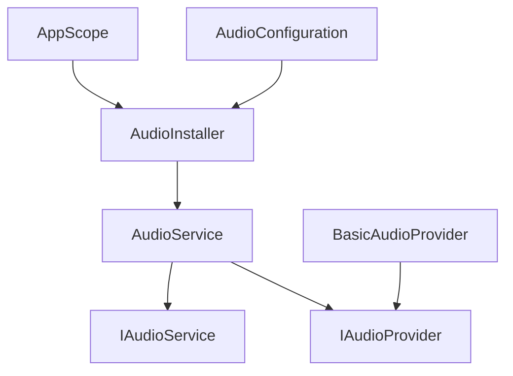
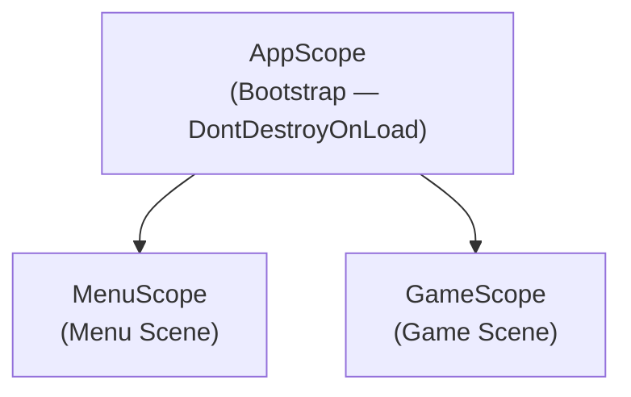
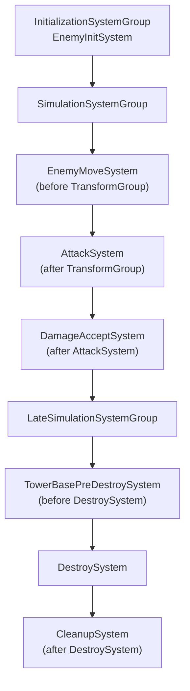

# Mermaid — Architecture Diagram Generator

Generates Mermaid diagrams for Unity project modules and systems. Outputs markdown that renders in GitHub, Notion, and most docs tools.

## Usage

`/mermaid` — prompts for what to diagram
`/mermaid Audio` — diagrams the Audio module
`/mermaid AppScope` — diagrams the VContainer scope hierarchy
`/mermaid ECS` — diagrams the ECS system update order
`/mermaid full` — diagrams all modules and their dependencies

## Steps

1. Determine scope from user input (module name, system, or full project)
2. Read relevant source files to understand actual dependencies — do NOT invent
3. Choose diagram type:
   - **Module internals** → `classDiagram`
   - **Dependency flow / DI wiring** → `graph TD`
   - **ECS system order** → `graph TD` with update group labels
   - **Scene scope hierarchy** → `graph TD`
   - **Event flow** → `sequenceDiagram`
4. Generate the diagram in a fenced code block
5. Add a 2-sentence explanation below the diagram

## Examples

### Module dependency graph

### VContainer scope hierarchy

### ECS system update order

## Rules

- Only diagram what actually exists in code — read the files first
- Keep node labels short (class name + role, no full namespace)
- If the diagram would exceed ~20 nodes, split into multiple focused diagrams
- Output the raw markdown block — the user pastes it where needed
