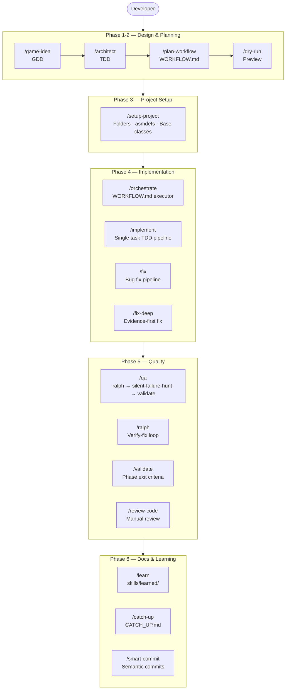
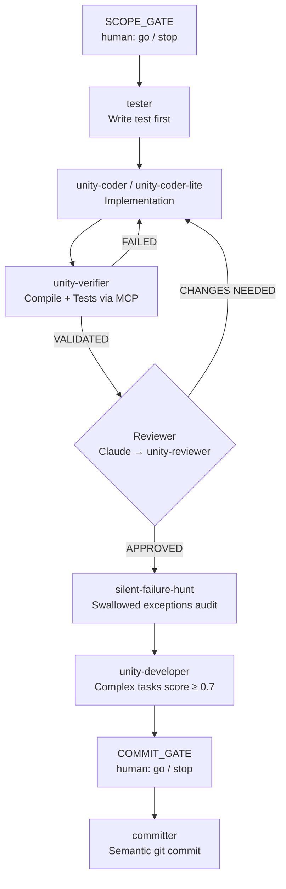
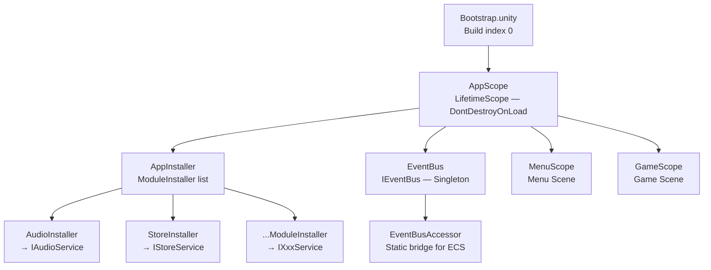
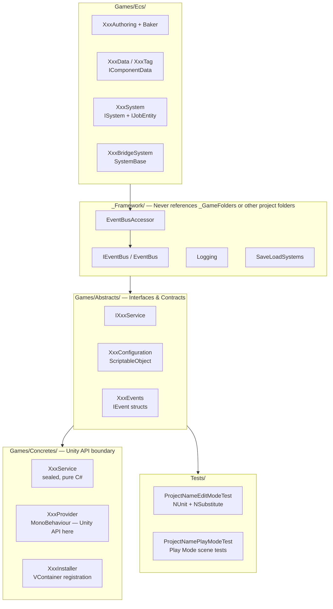
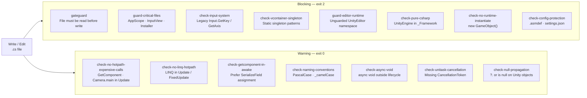

# Architecture Diagrams

Visual reference for the Unity Codex AI Template architecture. All diagrams reflect the conventions enforced by hooks and rules in `.codex/`.

---

## Pipeline — Command Flow

---

## Agent Pipeline — /implement & /fix

---

## VContainer Scope Hierarchy

---

## Architecture Layers

---

## Hook Flow — Every Write/Edit

